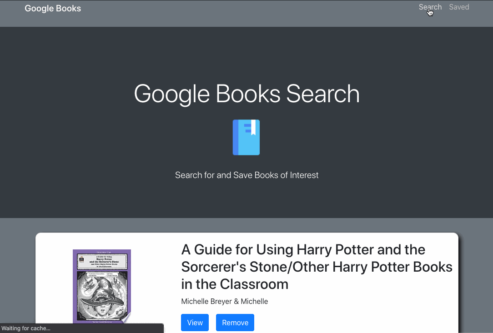

# googley-books-MERN


[](https://www.mit.edu/~amini/LICENSE.md)

## Table of Contents
* [Description](#Description)
* [Links](#Links)
* [Technologies](#Technologies)
* [Features](#Features)
* [Author](#Author)
* [Credits](#Credits)

## Description 
Welcome to our Google Books App! We make it easy for you to search any book and instantly get results. In our search page you will find the abilty to View the books through google or save it! We make it easy for you to track the books that you love so much by adding a saved page where you will find every book that you have saved as well as have the ability to view it or delete it. Thank you for checking out our page and happy reading! 

## Links
* [GitHub-Repo]()
* [Deployed-Link]()

## Technologies
* [react]()
* [axios]()
* [express]()
* [if-env]()
* [mongoose]()
* [react-router-dom]()

## Features


## Code
* 
```

```

* 
```

```

## Authors
Jenessa Fong
* [GitHub](https://github.com/janessaref)
* [linkedIn](www.linkedin.com/in/ivan-torres-0828931b2)

Josh Glugatch
* [GitHub](https://github.com/joshglugatch)
* [linkedIn](www.linkedin.com/in/ivan-torres-0828931b2)

Jon SanPedro
* [GitHub](https://github.com/jsp117)
* [linkedIn](www.linkedin.com/in/ivan-torres-0828931b2)

Ivan Torres
* [GitHub](https://github.com/IvanTorresMia)
* [linkedIn](www.linkedin.com/in/ivan-torres-0828931b2)

## Credits
* [StackOverFlow](https://stackoverflow.com/)
